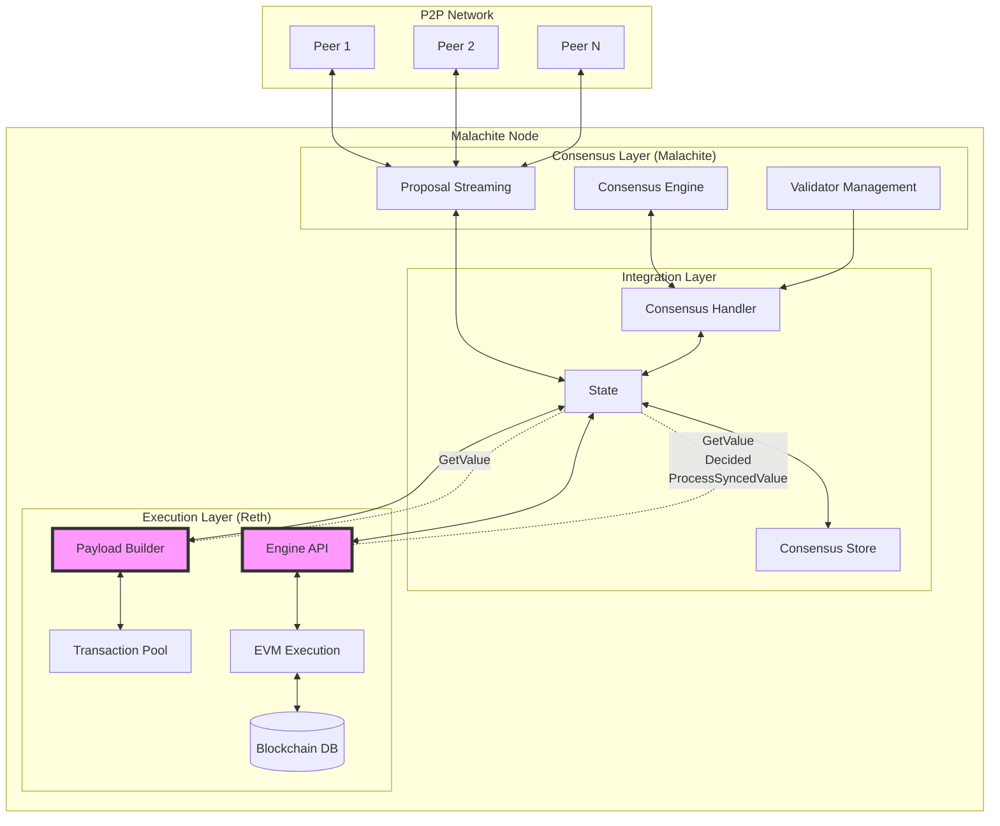
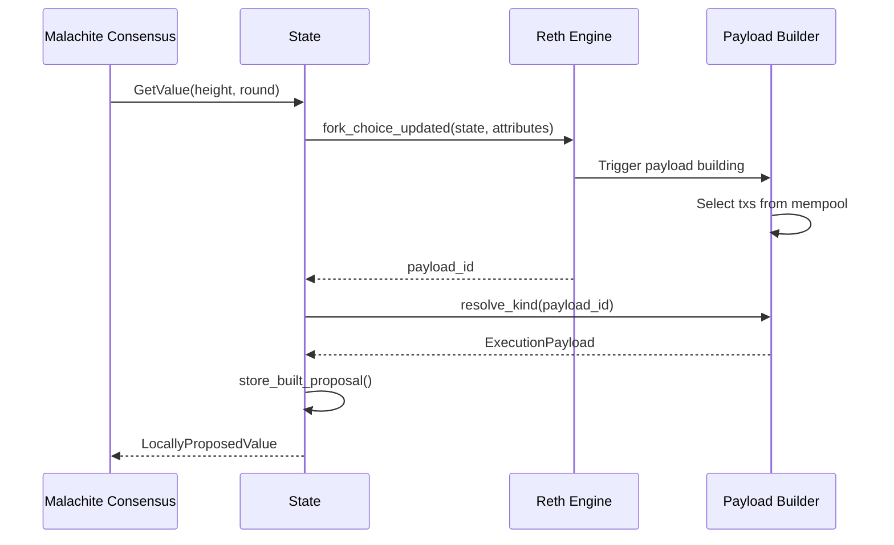
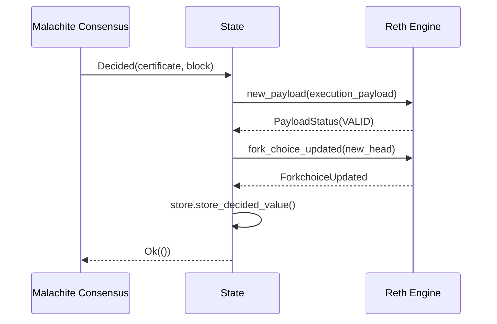
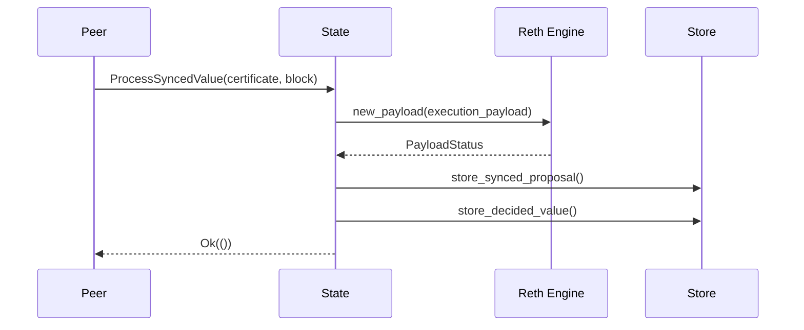
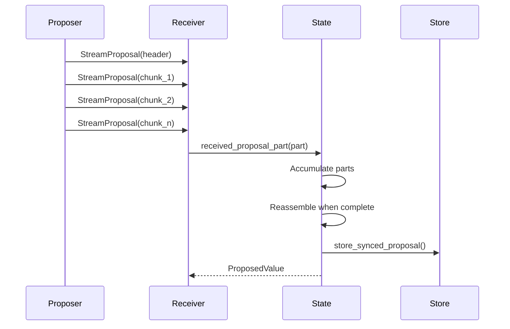

# Malachite-Reth Engine Interactions

This document describes the communication architecture between Malachite consensus and Reth execution engine in the reth-malachite implementation.

## Architecture Diagram



## Overview

The architecture follows a Tendermint-like pattern with ABCI-style separation:
- **Malachite** acts as the consensus engine (similar to Tendermint Core)
- **Reth** acts as the application/state machine (similar to the ABCI app)
- Communication happens through the **Engine API** (analogous to ABCI but using Ethereum's Engine API specification)

In this architecture:
- Consensus (Malachite) is responsible for block ordering and achieving agreement on the canonical chain
- The application (Reth) is responsible for transaction selection, ordering within blocks, execution, and maintaining state
- The Engine API provides the interface between consensus and execution layers

## Architecture

### Key Components

1. **BeaconConsensusEngineHandle** (`engine_handle`)
   - Primary communication channel to Reth's execution engine
   - Handles Engine API methods: `new_payload`, `fork_choice_updated`
   - Manages block validation and chain state updates

2. **PayloadBuilderHandle** (wrapped in `PayloadStore`)
   - Manages block building operations
   - Coordinates with mempool for transaction inclusion
   - Provides built payloads for consensus proposals

3. **Store** (abstraction layer)
   - Provides persistence for consensus data
   - Stores decided values, proposals, and validator sets
   - Abstracts away the underlying storage implementation

### State Structure

The State component manages the integration between Malachite consensus and Reth execution:

- **Engine Handle**: Primary communication channel to Reth via Engine API
- **Payload Store**: Manages block building operations through Reth's payload builder
- **Store**: Consensus-specific storage layer for decided values and proposals
- **Consensus State**: Tracks current height, round, role, and peer information
- **Streaming**: Handles proposal streaming between validators

## Communication Flows

### 1. Block Production Flow

When Malachite needs to propose a new block:



**Key Steps**:
1. Get parent block information to ensure monotonic timestamp increase
2. Prepare payload attributes with fee recipient and required post-merge fields
3. Call `fork_choice_updated` with attributes to trigger Reth's payload building
4. Use payload store to wait for and retrieve the built block
5. Store the proposal locally for potential restreaming to other validators

### 2. Block Finalization Flow

When consensus decides on a block:



**Key Steps**:
1. Find the proposal matching the decided value_id from undecided proposals
2. Store the decision certificate with the value for persistence
3. Validate the block through `new_payload` to ensure execution correctness
4. Update fork choice to make the block canonical in Reth
5. Due to instant finality in Malachite, head = safe = finalized block

### 3. Sync Block Validation Flow

During sync, blocks need validation before being stored:



**Key Steps**:
1. Convert synced block to execution payload format
2. Call `new_payload` to validate the block against Reth's execution rules
3. Return validation result based on payload status
4. Only proceed with storing the block if validation succeeds

### 4. Proposal Streaming Flow

For large blocks, proposals are streamed in parts:



**Streaming Pattern**:
- **Init**: Contains metadata (height, round, proposer, block hash)
- **Data**: Multiple chunks containing the serialized block (32KB each)
- **Fin**: Final message with signature for integrity verification

**Key Points**:
- Large blocks are split into manageable chunks for network efficiency
- Receivers accumulate parts and reassemble when complete
- Signature verification ensures proposal integrity
- Incomplete streams are tracked per peer with timeout handling

## Message Types

### Engine API Messages

1. **ForkchoiceState**
   ```rust
   ForkchoiceState {
       head_block_hash: B256,      // Current chain head
       safe_block_hash: B256,      // Latest safe block
       finalized_block_hash: B256, // Latest finalized block
   }
   ```

2. **PayloadAttributes**
   ```rust
   PayloadAttributes {
       timestamp: u64,                    // Block timestamp
       prev_randao: B256,                // Randomness (unused)
       suggested_fee_recipient: Address,  // Coinbase address
       withdrawals: Option<Vec<Withdrawal>>,
       parent_beacon_block_root: Option<B256>,
   }
   ```

3. **PayloadStatus**
   ```rust
   PayloadStatus {
       status: PayloadStatusEnum,  // VALID, INVALID, SYNCING
       latest_valid_hash: Option<B256>,
       validation_error: Option<String>,
   }
   ```

### Consensus Messages (AppMsg)

Messages from Malachite to the State:

1. **GetValue** - Request block proposal ✅ **Interacts with Reth**
   - Calls `fork_choice_updated` via Engine API to trigger payload building
   - Uses `payload_store.resolve_kind` to wait for and retrieve the built payload
   - Payload builder selects transactions from mempool and builds the block
   - Returns built block wrapped as `LocallyProposedValue`
2. **Decided** - Finalize decided block ✅ **Interacts with Reth**
   - Calls `new_payload` via Engine API to validate block execution
   - Calls `fork_choice_updated` to make block canonical in Reth
   - Updates chain head, safe block, and finalized block (all same due to instant finality)
3. **ProcessSyncedValue** - Validate synced block ✅ **Interacts with Reth**
   - Calls `new_payload` via Engine API to validate the synced block
   - Only stores block if Reth validation returns VALID or ACCEPTED
   - Returns None if block is INVALID or node is still SYNCING
4. **ConsensusReady** - Initialize consensus with starting height
5. **StartedRound** - New round started, update internal consensus state
6. **ExtendVote** / **VerifyVoteExtension** - Vote extension handling (not implemented)
7. **ReceivedProposalPart** - Handle streamed proposal chunks
8. **GetValidatorSet** - Query validator information from genesis config
9. **GetDecidedValue** - Query decided blocks from consensus store
10. **GetHistoryMinHeight** - Query earliest available height from store
11. **RestreamProposal** - Request proposal restreaming from store

## Store Abstraction Layer

The Store provides a clean abstraction for consensus data persistence:

### Store Interface

The Store provides persistence for consensus-specific data, separate from Reth's blockchain database:

**Key Responsibilities**:
- **Decided Values**: Store finalized blocks with their commit certificates
- **Undecided Proposals**: Cache proposals during consensus rounds
- **Block Data**: Store full block data indexed by hash
- **Height Tracking**: Track minimum and maximum decided heights

The Store uses Reth's database infrastructure but maintains separate tables for consensus data, ensuring clean separation between execution state and consensus metadata.

### Storage Organization

The Store manages:
- **Decided values**: Finalized blocks with their commit certificates
- **Built proposals**: Locally created block proposals for restreaming
- **Synced proposals**: Proposals received from other validators
- **Validator sets**: Validator configuration per height

## Thread Safety and Concurrency

The integration ensures thread-safe operation across async boundaries:

- **Consensus State**: Uses RwLock for concurrent read access to height, round, and role
- **Streaming State**: Manages per-peer proposal streams with thread-safe maps
- **Engine Communication**: Both engine handle and payload store are Arc-wrapped for safe sharing
- **Storage Layer**: Store implementation is inherently thread-safe

## Value Encoding/Decoding

The system uses different encoding strategies for different purposes:

- **Value Representation**: Blocks are represented by their hash (32 bytes) in consensus messages
- **Block Serialization**: Full blocks use Ethereum's standard encoding for storage and streaming
- **Proposal Streaming**: Blocks are chunked and streamed with metadata for efficient network transfer
- **Storage Format**: Consensus data uses binary encoding optimized for quick retrieval

## Consensus Handler

The consensus handler is the main event loop that:

- Receives messages from Malachite consensus engine
- Delegates to appropriate State methods
- Manages async request/reply pattern
- Handles errors and edge cases gracefully

This clean separation allows the consensus engine to remain agnostic about execution details while the State module handles all Reth-specific integration.

## Node Configuration

The integration configures Reth with custom components:

- **RethNode**: Custom node type that uses Malachite consensus instead of default PoS/PoW
- **MalachiteConsensusBuilder**: Replaces standard consensus validation (blocks are validated through Malachite)
- **Standard Reth Components**: Reuses transaction pool, networking, and execution components

This modular approach allows replacing just the consensus layer while keeping all other Reth functionality intact.


## Key Design Decisions

### Instant Finality
Malachite provides instant finality, unlike Ethereum's probabilistic finality. When a block is decided:
- It's immediately final (no reorgs possible)
- Fork choice update sets head = safe = finalized
- Simplifies state management and client behavior

### Separation of Concerns
- **Consensus (Malachite)**: Block ordering, validator management, Byzantine fault tolerance
- **Execution (Reth)**: Transaction execution, state management, block building
- **Clean Interface**: Engine API provides standard separation between layers

### Storage Architecture
- **Reth Database**: Blockchain state, transactions, receipts
- **Consensus Store**: Certificates, proposals, validator sets
- **No Overlap**: Each layer manages its own data

